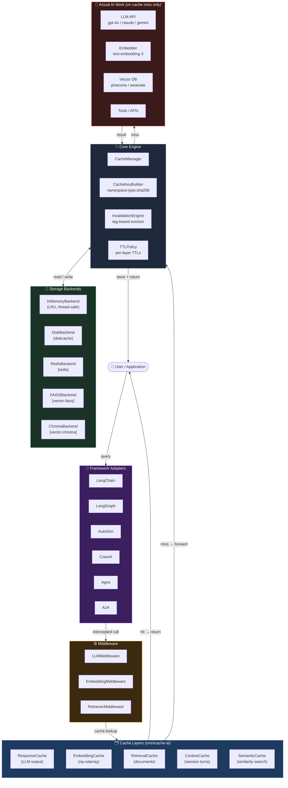
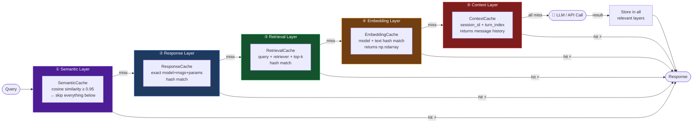
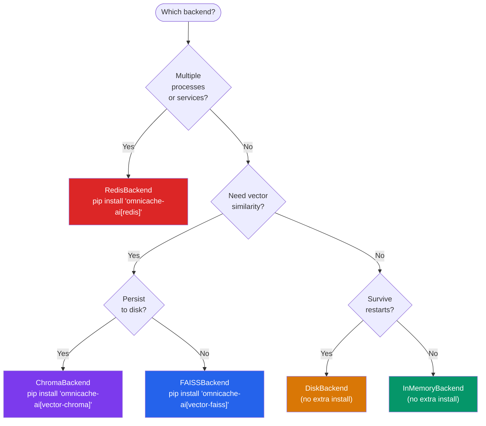

<div align="center">
  

  <h1>omnicache-ai</h1>

  <p><strong>Unified multi-layer caching for AI &amp; agent pipelines.</strong><br/>
  Drop it in front of any LLM call, embedding, retrieval query, or agent workflow<br/>
  to eliminate redundant API calls and cut latency and cost.</p>

  [](https://www.python.org/)
  [](https://pypi.org/project/omnicache-ai/)
  [](LICENSE)
  [](https://python.langchain.com/)
  [](https://langchain-ai.github.io/langgraph/)
  [](https://microsoft.github.io/autogen/)
  [](https://www.crewai.com/)
  [](https://www.agno.com/)

</div>

---

## Table of Contents

- [Why omnicache-ai?](#why-omnicache-ai)
- [Key Features](#key-features)
- [AI Agent Pipeline Architecture](#ai-agent-pipeline-architecture)
- [Installation](#installation)
- [Quick Start](#quick-start)
- [Cache Layers](#cache-layers)
- [Middleware](#middleware-decorator-pattern)
- [Framework Adapters](#framework-adapters)
- [Backends](#backends)
- [Tag-Based Invalidation](#tag-based-invalidation)
- [Custom Backend](#custom-backend)
- [Project Structure](#project-structure)
- [Development](#development)

---

## Why omnicache-ai?

Every AI agent pipeline makes the same expensive calls repeatedly:

| Without caching | With omnicache-ai |
|---|---|
| Every LLM call billed at full token cost | Identical prompts returned instantly, zero tokens |
| Embeddings re-computed on every request | Vectors stored and reused across sessions |
| Vector search re-run for same queries | Retrieval results cached by query + top-k |
| Agent state lost between runs | Session context persisted across turns |
| Semantically identical questions treated as new | Cosine similarity match returns cached answer |

---

## Key Features

### Cache Layers

| Layer | Class | What it caches | Serialization |
|---|---|---|---|
| LLM Response | `ResponseCache` | Model output keyed by model + messages + params | pickle |
| Embeddings | `EmbeddingCache` | `np.ndarray` vectors keyed by model + text | `np.tobytes()` |
| Retrieval | `RetrievalCache` | Document lists keyed by query + retriever + top-k | pickle |
| Context/Session | `ContextCache` | Conversation turns keyed by session ID + turn index | pickle |
| Semantic | `SemanticCache` | Answers reused for semantically similar queries (cosine ≥ threshold) | pickle |

### Storage Backends

| Backend | Class | Extras | Best For |
|---|---|---|---|
| In-Memory (LRU) | `InMemoryBackend` | — (core) | Dev, testing, single-process |
| Disk | `DiskBackend` | — (core) | Persistent, single-machine |
| Redis | `RedisBackend` | `[redis]` | Shared across processes / services |
| FAISS | `FAISSBackend` | `[vector-faiss]` | High-speed vector similarity |
| ChromaDB | `ChromaBackend` | `[vector-chroma]` | Persistent vector store + metadata |

### Framework Adapters

| Framework | Class | Hook Point | Async |
|---|---|---|---|
| LangChain ≥ 0.2 | `LangChainCacheAdapter` | `BaseCache` — `lookup` / `update` | ✅ `alookup` / `aupdate` |
| LangGraph ≥ 0.1 / 1.x | `LangGraphCacheAdapter` | `BaseCheckpointSaver` — `get_tuple` / `put` / `list` | ✅ `aget_tuple` / `aput` / `alist` |
| AutoGen ≥ 0.4 | `AutoGenCacheAdapter` | `AssistantAgent.run()` / `arun()` | ✅ `arun` |
| AutoGen 0.2.x | `AutoGenCacheAdapter` | `ConversableAgent.generate_reply()` | — |
| CrewAI ≥ 0.28 | `CrewAICacheAdapter` | `Crew.kickoff()` | ✅ `kickoff_async` |
| Agno ≥ 0.1 | `AgnoCacheAdapter` | `Agent.run()` / `arun()` | ✅ `arun` |
| A2A ≥ 0.2 | `A2ACacheAdapter` | `process()` / `wrap()` decorator | ✅ `aprocess` |

### Middleware

| Class | Wraps | Async |
|---|---|---|
| `LLMMiddleware` | Any sync LLM callable | — |
| `AsyncLLMMiddleware` | Any async LLM callable | ✅ |
| `EmbeddingMiddleware` | Any sync/async embed function | ✅ |
| `RetrieverMiddleware` | Any sync/async retriever | ✅ |

### Core Engine

| Component | Class | Description |
|---|---|---|
| Orchestrator | `CacheManager` | Central hub — wires backend, key builder, TTL policy, invalidation |
| Key Builder | `CacheKeyBuilder` | `namespace:type:sha256[:16]` canonical keys |
| TTL Policy | `TTLPolicy` | Global + per-layer TTL overrides |
| Eviction | `EvictionPolicy` | LRU / LFU / TTL-only strategies |
| Invalidation | `InvalidationEngine` | Tag-based bulk eviction |
| Settings | `OmnicacheSettings` | Dataclass + `from_env()` for 12-factor config |

---

## AI Agent Pipeline Architecture

### Where Cache Layers Sit in a Full AI Pipeline



---

### Cache Layer Responsibilities in the Pipeline



---

### Backend Selection by Use Case



---

## Installation

### Requirements

- Python ≥ 3.12
- Core dependencies: `diskcache`, `numpy` (installed automatically)

### pip

```bash
# Minimal — in-memory + disk backends
pip install omnicache-ai

# ── Framework adapters ──────────────────────────────────────────────
pip install 'omnicache-ai[langchain]'       # LangChain ≥ 0.2
pip install 'omnicache-ai[langgraph]'       # LangGraph ≥ 0.1 / 1.x
pip install 'omnicache-ai[autogen]'         # AutoGen legacy (pyautogen 0.2.x)
pip install 'autogen-agentchat>=0.4'        # AutoGen new API (separate package)
pip install 'omnicache-ai[crewai]'          # CrewAI ≥ 0.28 / 1.x
pip install 'omnicache-ai[agno]'            # Agno ≥ 0.1 / 2.x
pip install 'a2a-sdk>=0.3' omnicache-ai     # A2A SDK ≥ 0.2

# ── Storage backends ────────────────────────────────────────────────
pip install 'omnicache-ai[redis]'           # Redis
pip install 'omnicache-ai[vector-faiss]'    # FAISS vector search
pip install 'omnicache-ai[vector-chroma]'   # ChromaDB vector store

# ── Common combos ───────────────────────────────────────────────────
pip install 'omnicache-ai[langchain,redis]'
pip install 'omnicache-ai[langgraph,vector-faiss]'

# ── Everything ──────────────────────────────────────────────────────
pip install 'omnicache-ai[all]'
```

### uv (recommended)

```bash
uv add omnicache-ai
uv add 'omnicache-ai[langchain,redis]'
uv add 'omnicache-ai[all]'
```

### conda

```bash
conda install -c conda-forge omnicache-ai
```

### From source

```bash
git clone https://github.com/your-org/omnicache-ai
cd omnicache-ai
uv sync --dev         # installs all dev + core deps
uv run pytest         # verify install
```

### Verify

```bash
python -c "import omnicache_ai; print(omnicache_ai.__version__)"
# 0.1.0
```

### Environment variable configuration

| Variable | Default | Values |
|---|---|---|
| `OMNICACHE_BACKEND` | `memory` | `memory` · `disk` · `redis` |
| `OMNICACHE_REDIS_URL` | `redis://localhost:6379/0` | Any Redis URL |
| `OMNICACHE_DISK_PATH` | `/tmp/omnicache` | Any writable path |
| `OMNICACHE_DEFAULT_TTL` | `3600` | Seconds; `0` = no expiry |
| `OMNICACHE_NAMESPACE` | `omnicache` | Key prefix string |
| `OMNICACHE_SEMANTIC_THRESHOLD` | `0.95` | Float 0–1 |
| `OMNICACHE_TTL_EMBEDDING` | `86400` | Per-layer override |
| `OMNICACHE_TTL_RETRIEVAL` | `3600` | Per-layer override |
| `OMNICACHE_TTL_CONTEXT` | `1800` | Per-layer override |
| `OMNICACHE_TTL_RESPONSE` | `600` | Per-layer override |

```bash
export OMNICACHE_BACKEND=redis
export OMNICACHE_REDIS_URL=redis://localhost:6379/0
export OMNICACHE_DEFAULT_TTL=3600
```

```python
from omnicache_ai import CacheManager, OmnicacheSettings

manager = CacheManager.from_settings(OmnicacheSettings.from_env())
```

---

## Quick Start

```python
from omnicache_ai import CacheManager, InMemoryBackend, CacheKeyBuilder

manager = CacheManager(
    backend=InMemoryBackend(),
    key_builder=CacheKeyBuilder(namespace="myapp"),
)

manager.set("my_key", {"result": 42}, ttl=60)
value = manager.get("my_key")  # {"result": 42}
```

### LangChain in 3 lines

```python
from langchain_core.globals import set_llm_cache
from omnicache_ai import CacheManager, InMemoryBackend, CacheKeyBuilder
from omnicache_ai.adapters.langchain_adapter import LangChainCacheAdapter

set_llm_cache(LangChainCacheAdapter(CacheManager(backend=InMemoryBackend(), key_builder=CacheKeyBuilder())))
# Every ChatOpenAI / ChatAnthropic call is now cached automatically
```

---

## Cache Layers

### LLM Response Cache

Cache the string or dict output of any LLM call, keyed by model + messages + params.

```python
from omnicache_ai import CacheManager, InMemoryBackend, CacheKeyBuilder, ResponseCache

manager = CacheManager(backend=InMemoryBackend(), key_builder=CacheKeyBuilder(namespace="myapp"))
cache = ResponseCache(manager)

messages = [{"role": "user", "content": "What is 2+2?"}]

cache.set(messages, "4", model_id="gpt-4o")
answer = cache.get(messages, model_id="gpt-4o")  # "4"

# get_or_generate — calls generator only on cache miss
def call_llm(msgs):
    return openai_client.chat.completions.create(...).choices[0].message.content

answer = cache.get_or_generate(messages, call_llm, model_id="gpt-4o")
```

### Embedding Cache

```python
from omnicache_ai import EmbeddingCache

emb_cache = EmbeddingCache(manager)

vec = emb_cache.get_or_compute(
    text="Hello world",
    compute_fn=lambda t: embed_model.encode(t),
    model_id="text-embedding-3-small",
)
```

### Retrieval Cache

```python
from omnicache_ai import RetrievalCache

ret_cache = RetrievalCache(manager)

docs = ret_cache.get_or_retrieve(
    query="What is RAG?",
    retrieve_fn=lambda q: vectorstore.similarity_search(q, k=5),
    retriever_id="my-vectorstore",
    top_k=5,
)
```

### Context / Session Cache

```python
from omnicache_ai import ContextCache

ctx_cache = ContextCache(manager)

ctx_cache.set(session_id="user-123", turn_index=0, messages=[...])
history = ctx_cache.get(session_id="user-123", turn_index=0)

ctx_cache.invalidate_session("user-123")  # clear all turns for this session
```

### Semantic Cache

Returns a cached answer for semantically similar queries (cosine ≥ threshold). Requires `pip install 'omnicache-ai[vector-faiss]'`.

```python
from omnicache_ai import SemanticCache
from omnicache_ai.backends.memory_backend import InMemoryBackend
from omnicache_ai.backends.vector_backend import FAISSBackend

sem_cache = SemanticCache(
    exact_backend=InMemoryBackend(),
    vector_backend=FAISSBackend(dim=1536),
    embed_fn=lambda text: embed_model.encode(text),  # returns np.ndarray
    threshold=0.95,
)

sem_cache.set("What is the capital of France?", "Paris")

sem_cache.get("What is the capital of France?")       # "Paris" — exact
sem_cache.get("Which city is the capital of France?") # "Paris" — semantic hit
```

---

## Middleware (Decorator Pattern)

Wrap any sync/async LLM callable without changing its signature.

```python
from omnicache_ai import LLMMiddleware, CacheKeyBuilder, ResponseCache

middleware = LLMMiddleware(response_cache, key_builder, model_id="gpt-4o")

@middleware
def call_llm(messages: list[dict]) -> str:
    return openai_client.chat.completions.create(...).choices[0].message.content

wrapped = middleware(call_llm)  # or wrap an existing callable
```

```python
from omnicache_ai import AsyncLLMMiddleware

@AsyncLLMMiddleware(response_cache, key_builder, model_id="gpt-4o")
async def call_llm_async(messages):
    return await async_client.chat(messages)
```

Same pattern: `EmbeddingMiddleware`, `RetrieverMiddleware`

---

## Framework Adapters

### LangChain

```python
from langchain_core.globals import set_llm_cache
from omnicache_ai.adapters.langchain_adapter import LangChainCacheAdapter

set_llm_cache(LangChainCacheAdapter(manager))

llm = ChatOpenAI(model="gpt-4o")
response = llm.invoke("What is 2+2?")  # cached on second call
```

### LangGraph

Compatible with langgraph ≥ 0.1 and ≥ 1.0 — adapter auto-detects the API version.

```python
from omnicache_ai.adapters.langgraph_adapter import LangGraphCacheAdapter

saver = LangGraphCacheAdapter(manager)
graph = StateGraph(MyState).compile(checkpointer=saver)

result = graph.invoke({"messages": [...]}, config={"configurable": {"thread_id": "t1"}})
```

### AutoGen

```python
# autogen-agentchat 0.4+ (new API)
from autogen_agentchat.agents import AssistantAgent
from omnicache_ai.adapters.autogen_adapter import AutoGenCacheAdapter

agent = AssistantAgent("assistant", model_client=...)
cached = AutoGenCacheAdapter(agent, manager)
result = await cached.arun("What is 2+2?")

# pyautogen 0.2.x (legacy)
from autogen import ConversableAgent
agent = ConversableAgent(name="assistant", llm_config={...})
cached = AutoGenCacheAdapter(agent, manager)
reply = cached.generate_reply(messages=[{"role": "user", "content": "Hi"}])
```

### CrewAI

```python
from crewai import Crew
from omnicache_ai.adapters.crewai_adapter import CrewAICacheAdapter

crew = Crew(agents=[...], tasks=[...])
cached_crew = CrewAICacheAdapter(crew, manager)

result = cached_crew.kickoff(inputs={"topic": "AI trends"})
result = await cached_crew.kickoff_async(inputs={"topic": "AI trends"})
```

### Agno

```python
from agno.agent import Agent
from omnicache_ai.adapters.agno_adapter import AgnoCacheAdapter

agent = Agent(model=..., tools=[...])
cached = AgnoCacheAdapter(agent, manager)

response = cached.run("Summarize the latest AI research")
response = await cached.arun("Summarize the latest AI research")
```

### A2A (Agent-to-Agent)

```python
from omnicache_ai.adapters.a2a_adapter import A2ACacheAdapter

adapter = A2ACacheAdapter(manager, agent_id="planner")

# Explicit call
result = adapter.process(handler_fn, task_payload)
result = await adapter.aprocess(async_handler, task_payload)

# As a decorator
@adapter.wrap
def handle_task(payload: dict) -> dict:
    return downstream_agent.process(payload)
```

---

## Tag-Based Invalidation

```python
from omnicache_ai import InvalidationEngine, InMemoryBackend, CacheManager, CacheKeyBuilder

manager = CacheManager(
    backend=InMemoryBackend(),
    key_builder=CacheKeyBuilder(),
    invalidation_engine=InvalidationEngine(InMemoryBackend()),
)

manager.set("key1", "v1", tags=["model:gpt-4o", "env:prod"])
manager.set("key2", "v2", tags=["model:gpt-4o"])

count = manager.invalidate("model:gpt-4o")  # removes both entries

# ResponseCache / ContextCache tag automatically
from omnicache_ai import ResponseCache, ContextCache
rc = ResponseCache(manager)
rc.invalidate_model("gpt-4o")           # remove all gpt-4o responses

ctx = ContextCache(manager)
ctx.invalidate_session("user-123")      # clear all session turns
```

---

## Backends

| Backend | Extra | Use case |
|---|---|---|
| `InMemoryBackend` | — | Dev, testing, single-process |
| `DiskBackend` | — | Survives restarts, single-machine |
| `RedisBackend` | `[redis]` | Shared cache across processes/services |
| `FAISSBackend` | `[vector-faiss]` | Semantic/vector similarity search |
| `ChromaBackend` | `[vector-chroma]` | Persistent vector store with metadata |

```python
from omnicache_ai.backends.redis_backend import RedisBackend
from omnicache_ai.backends.disk_backend import DiskBackend

manager = CacheManager(backend=RedisBackend(url="redis://localhost:6379/0"), ...)
manager = CacheManager(backend=DiskBackend(path="/var/cache/omnicache"), ...)
```

---

## Custom Backend

Implement the `CacheBackend` Protocol — no inheritance required (structural typing):

```python
from omnicache_ai.backends.base import CacheBackend
from typing import Any

class MyBackend:
    def get(self, key: str) -> Any | None: ...
    def set(self, key: str, value: Any, ttl: int | None = None) -> None: ...
    def delete(self, key: str) -> None: ...
    def exists(self, key: str) -> bool: ...
    def clear(self) -> None: ...
    def close(self) -> None: ...

assert isinstance(MyBackend(), CacheBackend)  # True
```

---

## Project Structure

```
omnicache_ai/
├── __init__.py                 # Public API surface
├── __main__.py                 # CLI entry point (omnicache)
├── config/
│   └── settings.py             # OmnicacheSettings dataclass + from_env()
├── backends/
│   ├── base.py                 # CacheBackend + VectorBackend Protocols
│   ├── memory_backend.py       # InMemoryBackend (LRU, thread-safe, RLock)
│   ├── disk_backend.py         # DiskBackend (diskcache, process-safe)
│   ├── redis_backend.py        # RedisBackend [optional: redis]
│   └── vector_backend.py       # FAISSBackend + ChromaBackend [optional]
├── core/
│   ├── key_builder.py          # namespace:type:sha256[:16] canonical keys
│   ├── policies.py             # TTLPolicy, EvictionPolicy
│   ├── invalidation.py         # Tag-based InvalidationEngine
│   └── cache_manager.py        # Central orchestrator + from_settings()
├── layers/
│   ├── embedding_cache.py      # np.ndarray ↔ bytes serialization
│   ├── retrieval_cache.py      # list[Document] via pickle
│   ├── context_cache.py        # session_id + turn_index keyed
│   ├── response_cache.py       # model + messages + params keyed
│   └── semantic_cache.py       # exact → vector two-tier lookup
├── middleware/
│   ├── llm_middleware.py       # LLMMiddleware + AsyncLLMMiddleware
│   ├── embedding_middleware.py # EmbeddingMiddleware
│   └── retriever_middleware.py # RetrieverMiddleware
└── adapters/
    ├── langchain_adapter.py    # BaseCache (lookup/update/alookup/aupdate)
    ├── langgraph_adapter.py    # BaseCheckpointSaver (get_tuple/put/list + async)
    ├── autogen_adapter.py      # AssistantAgent 0.4+ + ConversableAgent 0.2.x
    ├── crewai_adapter.py       # Crew.kickoff() + kickoff_async()
    ├── agno_adapter.py         # Agent.run() + arun()
    └── a2a_adapter.py          # process() + aprocess() + @wrap
```

---

## Development

```bash
# Clone and install with dev deps
git clone https://github.com/your-org/omnicache-ai
cd omnicache-ai
uv sync --dev

# Run all tests
uv run pytest

# With coverage report
uv run pytest --cov=omnicache_ai --cov-report=term-missing

# Lint
uv run ruff check omnicache_ai

# Type check
uv run mypy omnicache_ai

# Run specific layer tests
uv run pytest tests/layers/ tests/core/ -v

# Run adapter tests (requires optional deps)
uv run pytest tests/adapters/ -v
```

---

## License

MIT — see [LICENSE](LICENSE)

---

<div align="center">
  <sub>Built with ❤️ for the AI engineering community</sub>
</div>
