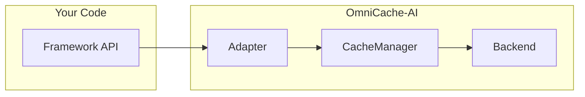

# Adapters

OmniCache-AI adapters provide drop-in integrations with popular AI and agent frameworks. Each adapter implements the framework's native cache or agent interface, so you get caching without changing your existing code.

## Overview

Adapters bridge the gap between OmniCache-AI's cache engine and the framework-specific APIs that each AI library expects. Instead of writing custom glue code, you instantiate an adapter with a `CacheManager` and plug it into the framework's standard extension point.

There are two adapter styles:

- **Interface adapters** (LangChain, LangGraph) -- subclass the framework's cache/checkpointer base class and implement its required methods. The framework calls these methods automatically.
- **Wrapper adapters** (AutoGen, CrewAI, Agno, A2A) -- wrap an agent or handler with cache logic. All non-overridden attributes proxy through to the original object via `__getattr__`.



---

## Framework Support Matrix

| Adapter | Framework | Min Version | Extra | Interface |
|---|---|---|---|---|
| [`LangChainCacheAdapter`](langchain.md) | LangChain | `langchain-core >= 0.2` | `pip install 'omnicache-ai[langchain]'` | `BaseCache` |
| [`LangGraphCacheAdapter`](langgraph.md) | LangGraph | `langgraph >= 0.1` | `pip install 'omnicache-ai[langgraph]'` | `BaseCheckpointSaver` |
| [`AutoGenCacheAdapter`](autogen.md) | AutoGen | `pyautogen >= 0.2` or `autogen-agentchat >= 0.4` | `pip install 'omnicache-ai[autogen]'` | Agent wrapper |
| [`CrewAICacheAdapter`](crewai.md) | CrewAI | `crewai >= 0.28` | `pip install 'omnicache-ai[crewai]'` | Crew wrapper |
| [`AgnoCacheAdapter`](agno.md) | Agno | `agno >= 0.1` | `pip install 'omnicache-ai[agno]'` | Agent wrapper |
| [`A2ACacheAdapter`](a2a.md) | A2A (Agent-to-Agent) | -- | `pip install omnicache-ai` | Handler wrapper / decorator |

---

## Quick Start

All adapters follow the same three-step pattern:

```python
from omnicache_ai import CacheManager, InMemoryBackend, CacheKeyBuilder

# 1. Create a CacheManager
manager = CacheManager(
    backend=InMemoryBackend(),
    key_builder=CacheKeyBuilder(namespace="myapp"),
)

# 2. Import the adapter
from omnicache_ai.adapters.langchain_adapter import LangChainCacheAdapter

# 3. Plug it in
adapter = LangChainCacheAdapter(manager)
```

!!! tip
    Install the `all` extra to get every framework dependency at once:
    ```bash
    pip install 'omnicache-ai[all]'
    ```

---

## Adapter Architecture

All wrapper-style adapters (AutoGen, CrewAI, Agno, A2A) implement the **transparent proxy** pattern:

1. Cache-aware methods (`run`, `kickoff`, `process`, etc.) check the cache before delegating to the wrapped object.
2. All other attribute accesses are forwarded to the wrapped object via `__getattr__`, so the adapter behaves identically to the original object for any non-cached operations.

```python
# The adapter acts like the original object
cached_agent = AutoGenCacheAdapter(agent, manager)
cached_agent.name          # proxied to agent.name
cached_agent.run("hello")  # cache-aware
```

---

## Choosing the Right Adapter

| If you use... | Use this adapter | Why |
|---|---|---|
| `langchain` LLMs / chat models | [`LangChainCacheAdapter`](langchain.md) | Implements `BaseCache` -- set it globally via `set_llm_cache()` |
| `langgraph` state graphs | [`LangGraphCacheAdapter`](langgraph.md) | Implements `BaseCheckpointSaver` -- pass to `compile(checkpointer=...)` |
| `pyautogen` 0.2.x agents | [`AutoGenCacheAdapter`](autogen.md) | Wraps `generate_reply()` with caching |
| `autogen-agentchat` 0.4+ agents | [`AutoGenCacheAdapter`](autogen.md) | Wraps `run()` / `arun()` with caching |
| `crewai` crews | [`CrewAICacheAdapter`](crewai.md) | Wraps `kickoff()` / `kickoff_async()` |
| `agno` agents | [`AgnoCacheAdapter`](agno.md) | Wraps `run()` / `arun()` |
| Custom A2A / inter-agent messaging | [`A2ACacheAdapter`](a2a.md) | Wraps any handler via `process()` or `@wrap` decorator |
| Custom LLM functions (no framework) | [Middleware](../middleware/index.md) | Use `LLMMiddleware` or `AsyncLLMMiddleware` directly |

---

## Next Steps

- [LangChain Adapter](langchain.md) -- Global LLM cache for LangChain
- [LangGraph Adapter](langgraph.md) -- Checkpoint persistence for state graphs
- [AutoGen Adapter](autogen.md) -- Cached agent replies for both API generations
- [CrewAI Adapter](crewai.md) -- Cached crew kickoff results
- [Agno Adapter](agno.md) -- Cached agent runs
- [A2A Adapter](a2a.md) -- Cached inter-agent messaging
