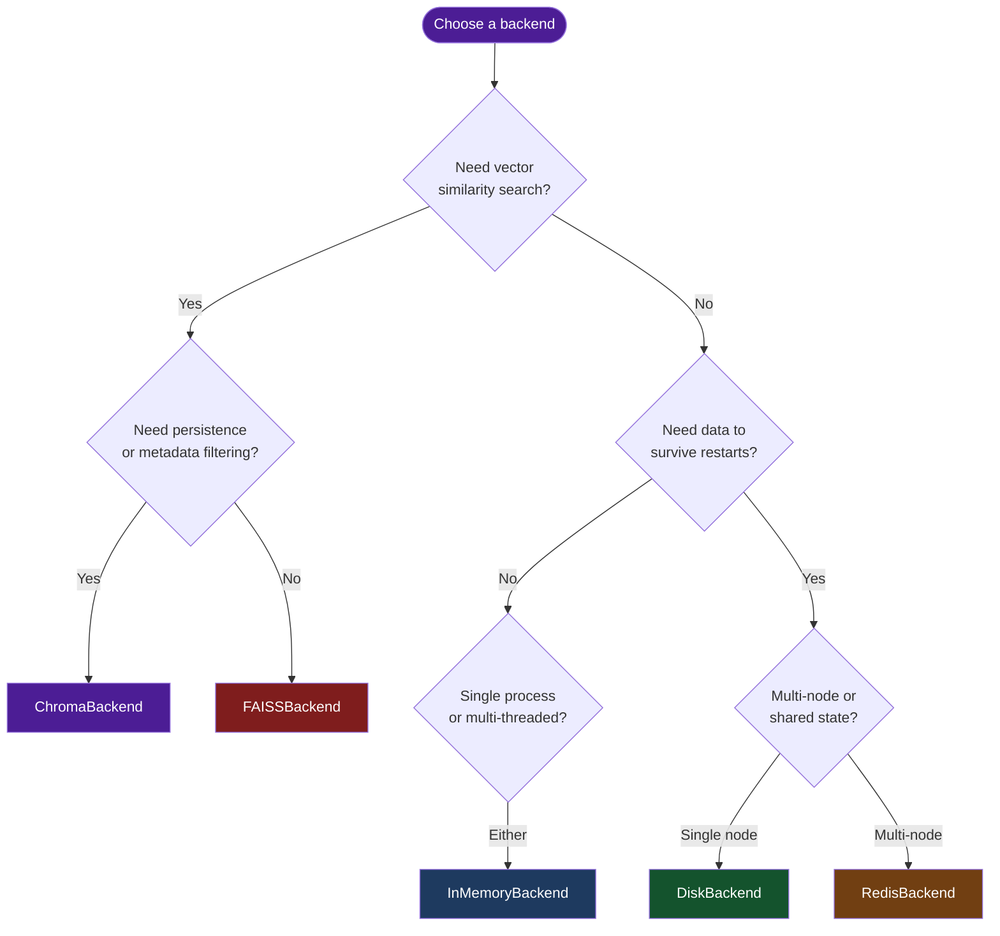

# Storage Backends

OmniCache-AI provides five interchangeable storage backends -- three for key-value caching and two for vector similarity search. Every backend conforms to a `Protocol`, so you can swap implementations without changing application code.

## Overview

Backends are the persistence layer beneath every cache layer. Choosing the right one depends on your durability requirements, latency budget, deployment topology, and whether you need exact-match or semantic-similarity lookups.

OmniCache-AI defines two protocols in `omnicache_ai.backends.base`:

- **`CacheBackend`** -- key-value storage with optional TTL (implemented by InMemoryBackend, DiskBackend, RedisBackend).
- **`VectorBackend`** -- vector similarity search over embedding spaces (implemented by FAISSBackend, ChromaBackend).

Both protocols are `@runtime_checkable`, so you can verify conformance with `isinstance()`.

## Decision Flowchart

Use the diagram below to pick the right backend for your workload.



## Comparison Table

### Key-Value Backends (CacheBackend)

| Feature | InMemoryBackend | DiskBackend | RedisBackend |
|---|---|---|---|
| **Persistence** | None (process lifetime) | Disk (survives restarts) | Redis server |
| **Multi-process safe** | No | Yes (SQLite locking) | Yes (server-based) |
| **Multi-node** | No | No | Yes |
| **TTL support** | Yes (per-entry) | Yes (native) | Yes (native) |
| **Eviction** | LRU (configurable max_size) | Size-based (size_limit) | Server-side policies |
| **Optional dependency** | None | `diskcache` (core) | `redis` |
| **Typical latency** | ~microseconds | ~milliseconds | ~milliseconds (network) |
| **Best for** | Dev, testing, single-process | Single-node production | Distributed production |

### Vector Backends (VectorBackend)

| Feature | FAISSBackend | ChromaBackend |
|---|---|---|
| **Similarity metric** | Cosine (via L2-norm + inner product) | Cosine (native HNSW) |
| **Persistence** | None (in-memory only) | Optional (PersistentClient) |
| **Metadata filtering** | No | Yes (Chroma native) |
| **Deletion support** | Soft (mapping removal) | Native |
| **Optional dependency** | `faiss-cpu` | `chromadb` |
| **Best for** | Fast in-process similarity | Production with persistence |

## Protocols

### CacheBackend Protocol

```python
from omnicache_ai.backends.base import CacheBackend

# Methods every key-value backend must implement:
# get(key: str) -> Any | None
# set(key: str, value: Any, ttl: int | None = None) -> None
# delete(key: str) -> None
# exists(key: str) -> bool
# clear() -> None
# close() -> None
```

### VectorBackend Protocol

```python
from omnicache_ai.backends.base import VectorBackend

# Methods every vector backend must implement:
# add(key: str, vector: np.ndarray, metadata: dict[str, Any]) -> None
# search(vector: np.ndarray, top_k: int = 1) -> list[tuple[str, float]]
# delete(key: str) -> None
# clear() -> None
# close() -> None
```

!!! tip "Runtime protocol checking"
    Both protocols are decorated with `@runtime_checkable`, so you can write
    `isinstance(my_backend, CacheBackend)` to verify at runtime that an object
    conforms to the expected interface.

## Backend Pages

- [InMemoryBackend](memory.md) -- Thread-safe LRU cache with TTL
- [DiskBackend](disk.md) -- Persistent disk cache via diskcache
- [RedisBackend](redis.md) -- Distributed cache via Redis
- [FAISSBackend](faiss.md) -- Vector similarity with FAISS
- [ChromaBackend](chroma.md) -- Vector similarity with ChromaDB
