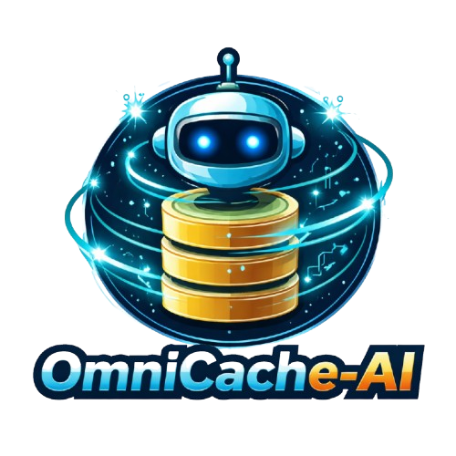
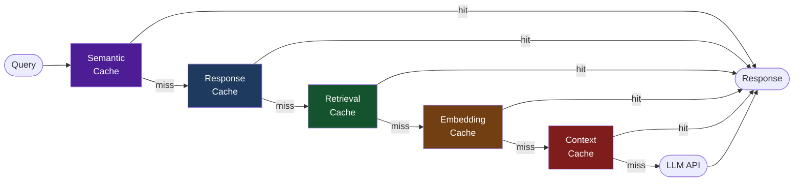

---
hide:
  - navigation
---

<div align="center">
  
  <h1>OmniCache-AI</h1>
  <p><strong>Unified multi-layer caching for AI agent pipelines</strong></p>

  <p>
    <a href="https://www.python.org/"></a>
    <a href="https://github.com/ashishpatel26/omnicache-ai/blob/main/LICENSE"></a>
    <a href="https://github.com/ashishpatel26/omnicache-ai"></a>
  </p>
</div>

---

## What is OmniCache-AI?

**OmniCache-AI** is a framework-agnostic caching library that sits between your application and expensive AI operations. It caches at every stage of the AI pipeline — embeddings, retrieval, context, LLM responses, and semantic similarity — eliminating redundant API calls and dramatically cutting latency and cost.

<div class="grid cards" markdown>

-   :material-layers-outline:{ .lg .middle } **5 Cache Layers**

    ---

    Response, Embedding, Retrieval, Context, and Semantic cache layers — each optimized for its data type.

    [:octicons-arrow-right-24: Cache Layers](layers/index.md)

-   :material-database:{ .lg .middle } **5 Storage Backends**

    ---

    In-Memory (LRU), Disk, Redis, FAISS, and ChromaDB. Pick the right backend for your scale.

    [:octicons-arrow-right-24: Backends](backends/index.md)

-   :material-puzzle:{ .lg .middle } **6 Framework Adapters**

    ---

    LangChain, LangGraph, AutoGen, CrewAI, Agno, and A2A. Drop-in integration with zero code changes.

    [:octicons-arrow-right-24: Adapters](adapters/index.md)

-   :material-brain:{ .lg .middle } **Semantic Cache**

    ---

    Returns cached answers for semantically similar queries using cosine similarity — not just exact matches.

    [:octicons-arrow-right-24: Semantic Cache](layers/semantic.md)

</div>

---

## Why OmniCache-AI?

| Without caching | With OmniCache-AI |
|---|---|
| Every LLM call billed at full token cost | Identical prompts returned instantly, zero tokens |
| Embeddings re-computed on every request | Vectors stored and reused across sessions |
| Vector search re-run for same queries | Retrieval results cached by query + top-k |
| Agent state lost between runs | Session context persisted across turns |
| Semantically identical questions treated as new | Cosine similarity match returns cached answer |

---

## Quick Example

```python
from omnicache_ai import CacheManager, InMemoryBackend, CacheKeyBuilder

manager = CacheManager(
    backend=InMemoryBackend(),
    key_builder=CacheKeyBuilder(namespace="myapp"),
)

# Cache any value
manager.set("my_key", b"result data", ttl=60)
value = manager.get("my_key")  # b"result data"
```

---

## Pipeline Architecture



---

## Get Started

<div class="grid cards" markdown>

-   [:octicons-download-24: **Installation**](getting-started/installation.md)

    Install via pip, uv, or from GitHub

-   [:octicons-rocket-24: **Quick Start**](getting-started/quickstart.md)

    Your first cache in 30 seconds

-   [:octicons-book-24: **Cookbook**](cookbook/index.md)

    40+ runnable recipes for every framework

-   [:octicons-code-24: **API Reference**](api-reference/index.md)

    Complete class and method documentation

</div>
